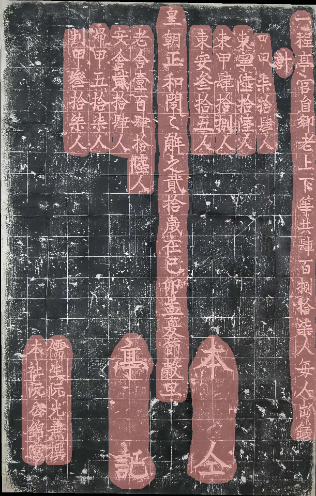
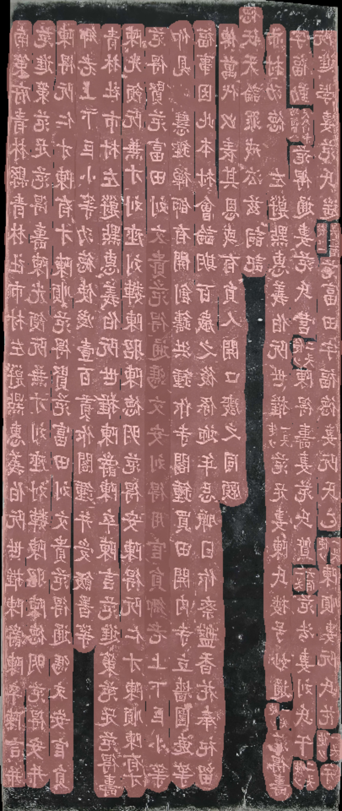
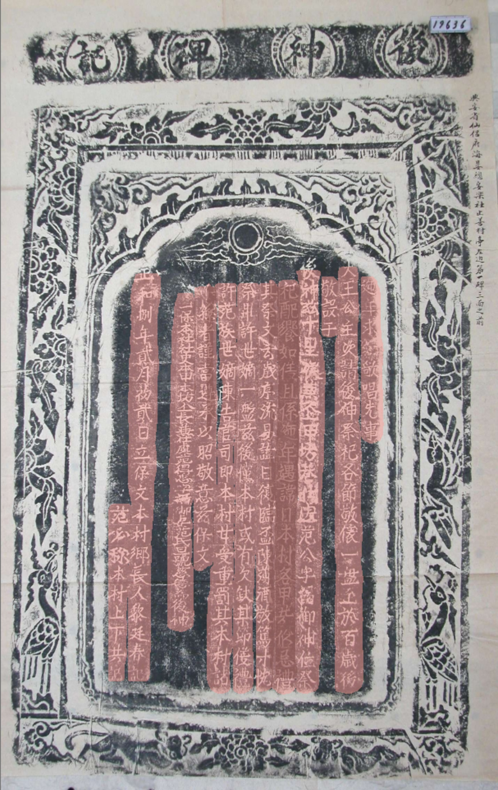
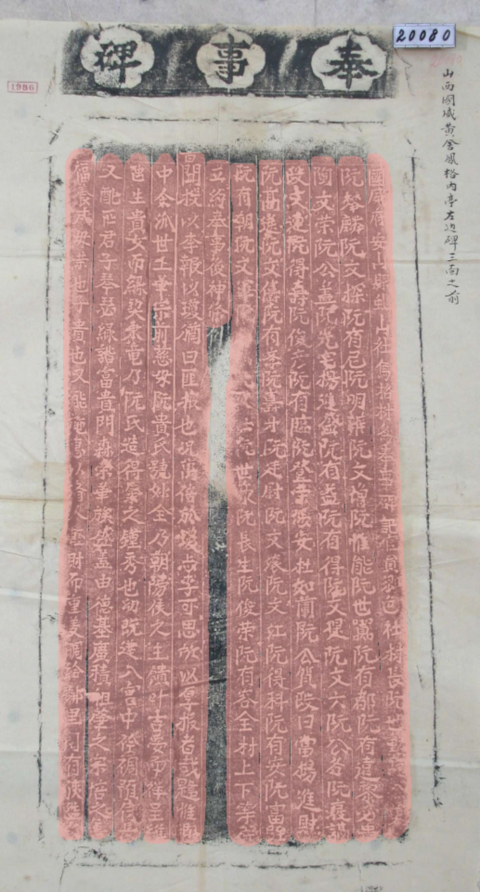

# steles-seg

Yolo segmentation model trained during 8 hours on 360 images (initial = 40 images + data augmentation = 40 x 8), 200 epochs. 

### Results 

[Link : Preparation of the dataset](https://youtu.be/yPppskB2zK8)

